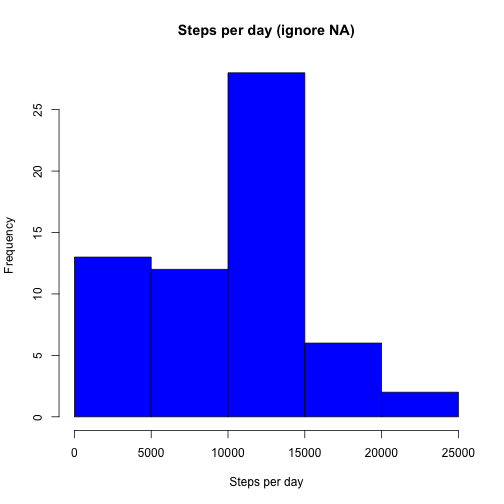
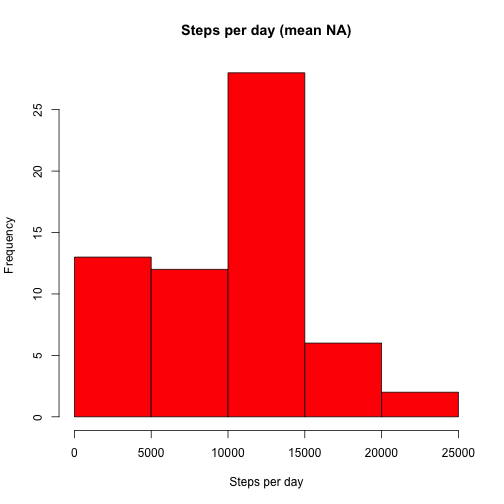
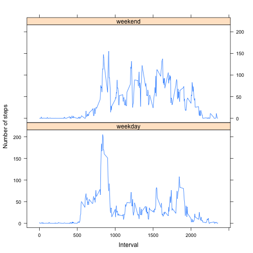

# Reproducible Research: Peer Assessment 1  
Thanks for evaluating my work!  

Complete R code is in PA1.R :)

## Loading and preprocessing the data

* Load the data


```r
data <- read.csv("./activity.csv")
```


* Process/transform the data (if necessary) into a format suitable for your analysis


```r
# convert date format for later use
data$date_c <- as.POSIXlt(data$date)
```


## What is mean total number of steps taken per day?

For this part of the assignment, you can ignore the missing values in the dataset.

* Make a histogram of the total number of steps taken each day


```r
# calculate the steps per day, removing NA values
stepsPerDayNoNA <- tapply(data$steps, data$date, sum, na.rm = T)
# creat the histogram
hist(stepsPerDayNoNA, main = "Steps per day (ignore NA)", col = "blue", xlab = "Steps per day")
```

 


* Calculate and report the mean and median total number of steps taken per day


```r
mean(stepsPerDayNoNA)
```

```
## [1] 9354
```

```r
median(stepsPerDayNoNA)
```

```
## [1] 10395
```


The mean number of steps taken per day is 9354.2295, and the median number is 10395.

## What is the average daily activity pattern?

* Make a time series plot (i.e. type = "l") of the 5-minute interval (x-axis) and the average number of steps taken, averaged across all days (y-axis)


```r
# calculate the average steps per interval
avgStepsPer5MinNoNA <- tapply(data$steps, data$interval, mean, na.rm = T)
# plot average daily activity
plot(levels(as.factor(data$interval)), avgStepsPer5MinNoNA, type = "l", main = "Average daily activity pattern", 
    xlab = "Interval", ylab = "Average steps per interval")
```

 


* Which 5-minute interval, on average across all the days in the dataset, contains the maximum number of steps?


```r
which(avgStepsPer5MinNoNA == max(avgStepsPer5MinNoNA))
```

```
## 835 
## 104
```


The interval "835" contains the maximum nubmer of steps, which is the 104th element in "avgStepsPer5MinNoNA".

## Imputing missing values

Note that there are a number of days/intervals where there are missing values (coded as NA). The presence of missing days may introduce bias into some calculations or summaries of the data.

* Calculate and report the total number of missing values in the dataset (i.e. the total number of rows with NAs)


```r
sum(is.na(data$steps))
```

```
## [1] 2304
```


The total number of rows with NAs is 2304.

* Devise a strategy for filling in all of the missing values in the dataset. The strategy does not need to be sophisticated. For example, you could use the mean/median for that day, or the mean for that 5-minute interval, etc.

Here I used the method of replacing NA values with the median for that interval. I found the median makes more sense because step should be an integer. Also, if we use the method of mean/median for a day, since there are days where all values are NA, it will introduce NaN's, which are not what we wanted.


```r
# create a function for replacing NA with median
replaceNAwithMedian <- function(x) {
    m <- median(x, na.rm = TRUE)
    x[is.na(x)] <- m
    x
}
```


* Create a new dataset that is equal to the original dataset but with the missing data filled in.


```r
# replicate data into data1
data1 <- data
# apply the replacing function for steps in each interval
data1$steps <- ave(data$steps, data$interval, FUN = replaceNAwithMedian)
```


* Make a histogram of the total number of steps taken each day and Calculate and report the mean and median total number of steps taken per day. Do these values differ from the estimates from the first part of the assignment? What is the impact of imputing missing data on the estimates of the total daily number of steps?


```r
stepsPerDayMeanNA <- tapply(data1$steps, data1$date, sum, na.rm = T)
hist(stepsPerDayMeanNA, main = "Steps per day (mean NA)", col = "red", xlab = "Steps per day")
```

 

```r
mean(stepsPerDayMeanNA)
```

```
## [1] 9504
```

```r
median(stepsPerDayMeanNA)
```

```
## [1] 10395
```


The mean value has changed from 9354.2295 to 9503.8689. The total daily number of steps **increased** after NA values being replaced with median values per interval.

## Are there differences in activity patterns between weekdays and weekends?

For this part the weekdays() function may be of some help here. Use the dataset with the filled-in missing values for this part.

* Create a new factor variable in the dataset with two levels – “weekday” and “weekend” indicating whether a given date is a weekday or weekend day.


```r
# Here we used the way component of date_c, where 0-6 represents Sunday
# through Saturday
data1$weekdayFactor <- ifelse(data1$date_c$wday == 0 | data1$date_c$wday == 
    6, "weekend", "weekday")
```


* Make a panel plot containing a time series plot (i.e. type = "l") of the 5-minute interval (x-axis) and the average number of steps taken, averaged across all weekday days or weekend days (y-axis).


```r
library(lattice)
xyplot(steps ~ interval | weekdayFactor, data1, type = "a", layout = c(1, 2), 
    xlab = "Interval", ylab = "Number of steps", ylim = c(min(avgStepsPer5MinNoNA) - 
        10, max(avgStepsPer5MinNoNA) + 10))
```

 


**End of the assignment. Thanks again for your time. :)**
